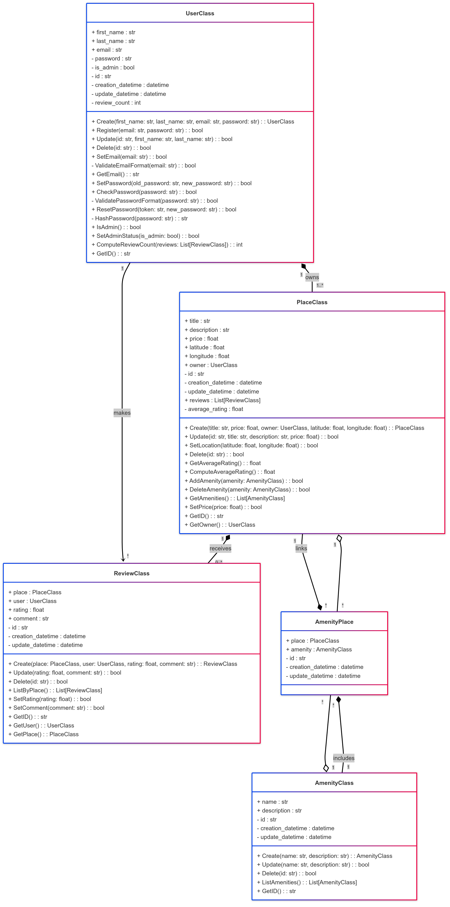

# HBnB - Technical Design Documentation

## 📘 Introduction

This document serves as the comprehensive technical blueprint for the HBnB project — a simplified clone of Airbnb. It has been created to provide a clear and structured guide to the system's architecture, internal logic, and interactions.

The aim is to ensure all developers and stakeholders share a consistent understanding of the system. It will also help onboard new contributors, support debugging and refactoring, and serve as a long-term reference throughout the development process.

### 📄 Contents of This Document

* High-Level Architecture: Structural overview and interactions between system layers
* Business Logic Layer: Class diagram showing core objects and relationships
* API Interaction Flow: Sequence diagrams explaining key user actions and how data flows between components

---

## 🧱 1. High-Level Package Diagram

The HBnB system is organized into three main layers, following a **layered architectural pattern**. Each layer is designed to encapsulate specific responsibilities and reduce coupling between components.

### 🔹 Layers Description

* **API Layer (UserAPI):** Handles all external requests. It receives user input, forwards it to the business logic, and returns HTTP responses.
* **Business Logic Layer (BusinessLogic):** Implements the application's core functionality. It performs input validation, coordinates object creation, and applies business rules.
* **Data Access Layer (Database):** Responsible for persistence. It performs read/write operations on entities like users, places, reviews, and amenities.

This layered separation also enables testing, maintenance, and scaling each part independently.

### 🔹 Diagram Explanation

The high-level package diagram represents the above layers and their interactions:

* The API communicates directly with the Business Logic layer only.
* The Business Logic is the only layer that interacts with the Database.
* The API layer acts as a **facade**, exposing clean, simplified operations to the external world.

In the diagram:

* `PresentationLayer` exposes API endpoints and services.
* `BusinessLogicLayer` contains all domain models and a `BusinessFacade` class.
* `PersistenceLayer` handles the storage access logic.
* Arrows represent the data/control flow between layers.

---

## 🧩 2. Class Diagram

This section describes the core domain entities of the HBnB application and their behaviors. Each class encapsulates data and logic relevant to its role.

### 🔹 Key Classes

#### 🧍‍♂️ UserClass

Represents a user of the platform. Includes attributes like name, email, admin status, and timestamps. Offers methods for registration, authentication, password management, and admin role checks.

#### 🏠 PlaceClass

Represents a property listed on the platform. Includes attributes like title, price, location, and amenities. It is owned by a User and can be reviewed. It includes logic for setting location, pricing, and associating amenities.

#### 📝 ReviewClass

Models a review left by a user on a place. Contains a rating and a comment. Connected to both User and Place. It provides methods to update, delete, and retrieve reviews.

#### 🎯 AmenityClass

Represents a service (e.g., Wi-Fi, air conditioning). These are reusable and shared among places.

#### 🔗 AmenityPlace

An association class used to model the many-to-many relationship between PlaceClass and AmenityClass.

### 🔹 Relationships

* One `User` can own many `Place`s.
* One `Place` can have many `Review`s.
* One `User` can create multiple `Review`s.
* A `Place` can include multiple `Amenity`s, and each `Amenity` can be shared across places (many-to-many).

The diagram includes visibility (+ public, - private), data types, method return types, and class responsibilities.

---

## 🔄 3. Sequence Diagrams

This section presents the runtime behavior of the system in response to specific user actions. It helps understand the control flow and error handling logic.

### 🔹 Register User

**Scenario:** A user registers by providing an email and password.

**Purpose:** To create a new user entry in the system after validating credentials and ensuring uniqueness.

**Steps shown in the diagram:**

1. The API receives the request and delegates it to the business logic.
2. The email format is validated.
3. The system checks whether the email already exists.
4. The password format is validated.
5. The password is hashed.
6. The user is inserted into the database.
7. Appropriate error responses (e.g., 400, 409, 500) are returned if any step fails.
8. On success, the system responds with HTTP 201.

### 🔹 Create Place

**Scenario:** A logged-in user creates a new listing.

**Purpose:** To register a new property in the system.

**Steps shown in the diagram:**

1. Required fields (title, price, location) are validated.
2. The price format and latitude/longitude are checked.
3. The user is associated as the owner.
4. The new place is persisted to the database.
5. Errors are handled and reported clearly (e.g., missing fields or DB failure).
6. On success, a 201 response is returned.

### 🔹 Submit Review

**Scenario:** A user posts a review for a specific place.

**Purpose:** To let users provide feedback on listings they have interacted with.

**Steps shown in the diagram:**

1. The frontend submits review data to the API.
2. The API validates the content via the ReviewModel.
3. The system checks if the target place exists.
4. The review is saved in the database.
5. Errors (invalid input, place not found, database error) are handled.
6. On success, a 201 response is returned.

### 🔹 Filter Places

**Scenario:** A user searches for listings with specific filters (e.g., location, price).

**Purpose:** To allow dynamic and efficient querying of places matching user preferences.

**Steps shown in the diagram:**

1. The user submits search criteria to the API.
2. The API forwards them to the PlaceModel.
3. Filters are validated.
4. A query is executed in the database.
5. Results are returned or errors (invalid query, database issue) are handled.
6. On success, a JSON list of places is sent back with HTTP 200.

Each diagram demonstrates data validation, error handling, and data flow between layers.

---

## ✅ Conclusion

This document brings together all design elements of the HBnB project into one reference. It clearly separates concerns between layers, defines object responsibilities, and explains the runtime behavior of the application.

---

**Authors:** 
Alcinoe Romanelli--Fromy & Julia Costa de Sousa
