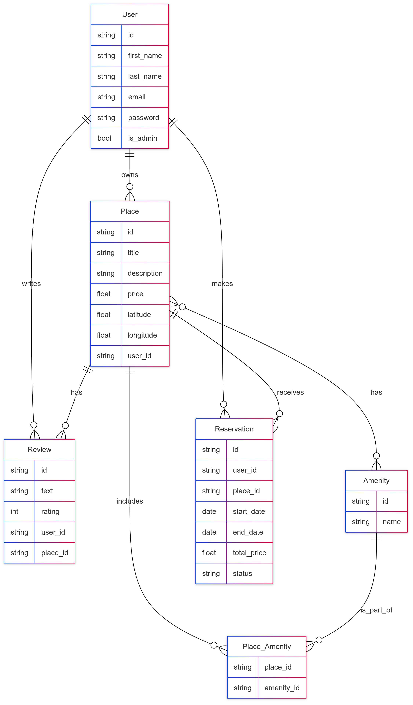

# ___HBnB Project___
## ___Project Structure___
```
.
├── app/
│   ├── __init__.py
│   ├── Insert_Initial_Data.sql
│   ├── SQL_tables.sql
│   ├── extensions.py
│   ├── api/
│   │   ├── __init__.py
│   │   └── v1/
│   │       ├── __init__.py
│   │       ├── users.py
│   │       ├── auth.py
│   │       ├── places.py
│   │       ├── protected.py
│   │       ├── reviews.py
│   │       └── amenities.py
│   ├── models/
│   │   ├── __init__.py
│   │   ├── base_model.py
│   │   ├── user.py
│   │   ├──associations.py
│   │   ├── place.py
│   │   ├── review.py
│   │   └──amenity.py
│   ├── services/
│   │   ├── __init__.py
│   │   └── facade.py       
│   └── persistence/
│       ├── __init__.py
│       ├── repository.py
│       ├── amenity_repository.py
│       ├── place_repository.py
│       ├── review_repository.py
│       └── user_repository.py       
├── run.py
├── config.py
├── requirements.txt
└── README.md
└── tests/
    ├── __pycache__/
    └── api/
        ├── __pycache__/
        ├── test_amenities.py
        ├── test_places.py
        ├── test_reviews.py
        └── test_users.py
```
## ___Installing Dependencies___
To install the required packages, run the following command in your terminal:
```bash
pip install -r requirements.txt
```
## ___Entity Relationship Diagram___

This diagram illustrates the core entities of the HBnB platform and the relationships between them. It defines the logical structure of the database and shows how users, places, reviews, amenities, and other components interact.

**User**: Represents individuals using the platform, either as guests or administrators.

**Place**: Represents properties listed on the platform that can be reviewed or booked.

**Review**: Stores feedback and ratings provided by users for specific places.

**Amenity**: Lists the features or services available in each place (e.g., Wi-Fi, Pool, Parking).

**Place_Amenity**: A join table to handle the many-to-many relationship between Places and Amenities.

**Reservation**: Represents a potential extension to track which user booked which place and when.

This diagram provides a structural overview that supports the design, implementation, and maintenance of both the business logic and persistence layers of the project.
## ___Business Logic Layer___
The business logic layer is responsible for enforcing the business rules that govern the platform's operation. It is independent of the API (Flask) and database layers, allowing for greater modularity, testability, and code clarity.
### ___Entities and their responsibilities___
#### __User__
Represents an individual registered on the platform.
_Attributes:_
- `id` (str): Unique identifier.
- `first_name` (str): First name (required, max. 50 characters).
- `last_name` (str): Last name (required, max. 50 characters).
- `email` (str): Unique and valid email address.
- `is_admin` (bool): Admin role (default: False).
- `created_at` / `updated_at` (datetime)
_Responsibilities:_
- Manage identity data.
- Verify email uniqueness and validity.
- Identify administrator users.
- Be associated with created locations and
reviews.
_Example of use:_
```python
user = User(
    id="u001",
    first_name="Ping",
    last_name="Pong",
    email="alice@example.com"
)
print(user.email)        # cesar@example.com
print(user.is_admin)     # False
```
#### __Place__
Represents a property available for booking.
_Attributes:_
- `id` (str): Unique identifier.
- `title` (str): Title (required, max. 100 characters).
- `description` (str): Description of the property.
- `price` (float): Price per night (positive).
- `latitude` / `longitude` (float): Geographic coordinates.
- `owner` (User): Owner user.
- `created_at` / `updated_at` (datetime)
_Responsibilities:_
- Validate geographic coordinates and price.
- Be associated with a valid owner.
- Be listed, filtered, or rated.
_Example of use:_
```python
place = Place(
    id="p002",
    title="villa in Monaco",
    description="Ideal for a weekend.",
    price=520.0,
    latitude=78.8676,
    longitude=7.3432,
    owner=user
)
print(place.title)       # villa in Monaco
print(place.price)       # 520.0
```
#### __Review__
Represents a user's rating of a place.
_Attributes:_
- `id` (str): Unique identifier.
- `text` (str): Content (required).
- `rating` (int): Rating between 1 and 5.
- `place` (Place): Location concerned.
- `user` (User): Author of the review.
- `created_at` / `updated_at` (datetime)
_Responsibilities:_
- Validate that the rating is between 1 and 5.
- Be connected to an existing user and place.
- Contribute to a place's reputation.
_Example of use:_
```python
review = Review(
    id="r001",
    text="Very expensive.",
    rating=3,
    place=place,
    user=user
)
print(review.rating)         # 5
print(review.place.title)    # villa in Monaco
```
#### __Amenity__
Represents an item of equipment or service associated with a location (e.g., Wi-Fi, Parking, Pool).
_Attributes:_
- `id` (str): Unique identifier.
- `name` (str): Name of the item (required, max. 50 characters).
- `created_at` / `updated_at` (datetime)
_Responsibilities:_
- Be linked to one or more locations.
- Allows filtering of locations by equipment.
_Example of use:_
```python
wifi = Amenity(id="b566", name="Wi-Fi")
print(wifi.name)  # Wi-Fi


## ___API Endpoints Overview___
🔐 Authentication
POST /api/v1/auth/login — Log in and retrieve JWT token.

👤 Users
GET /api/v1/users/ — List all users (Admin only).

POST /api/v1/users/ — Create a new user.

GET /api/v1/users/<user_id> — Get a user’s details.

PUT /api/v1/users/<user_id> — Update a user (self or admin).

DELETE /api/v1/users/<user_id> — Delete a user (self or admin).

🏠 Places
GET /api/v1/places/ — List all places.

POST /api/v1/places/ — Create a new place (auth required).

GET /api/v1/places/<place_id> — Get place details.

PUT /api/v1/places/<place_id> — Update a place (owner or admin).

DELETE /api/v1/places/<place_id> — Delete a place (owner or admin).

📝 Reviews
GET /api/v1/reviews/ — List all reviews.

POST /api/v1/reviews/ — Create a review (auth required).

GET /api/v1/reviews/<review_id> — Get review details.

PUT /api/v1/reviews/<review_id> — Update a review (owner or admin).

DELETE /api/v1/reviews/<review_id> — Delete a review (owner or admin).

🛎️ Amenities
GET /api/v1/amenities/ — List all amenities.

POST /api/v1/amenities/ — Create a new amenity.

GET /api/v1/amenities/<amenity_id> — Get amenity details.

PUT /api/v1/amenities/<amenity_id> — Update an amenity.

DELETE /api/v1/amenities/<amenity_id> — Delete an amenity.

Business Logic Layer
🧍 User
Represents an individual registered on the platform.

python
Copier
user = User(
    id="u001",
    first_name="Ping",
    last_name="Pong",
    email="alice@example.com"
)
print(user.email)        # alice@example.com
print(user.is_admin)     # False
🏡 Place
Represents a property available for booking.

python
Copier
place = Place(
    id="p002",
    title="villa in Monaco",
    description="Ideal for a weekend.",
    price=520.0,
    latitude=78.8676,
    longitude=7.3432,
    owner=user
)
print(place.title)       # villa in Monaco
print(place.price)       # 520.0
⭐ Review
Represents a user's rating of a place.

python
Copier
review = Review(
    id="r001",
    text="Very expensive.",
    rating=3,
    place=place,
    user=user
)
print(review.rating)         # 3
print(review.place.title)    # villa in Monaco
⚙️ Amenity
Represents an equipment/service associated with a location.

python
Copier
wifi = Amenity(id="b566", name="Wi-Fi")
print(wifi.name)  # Wi-Fi

#Alcinoe Romanelli
#Julia Coscadesousa
